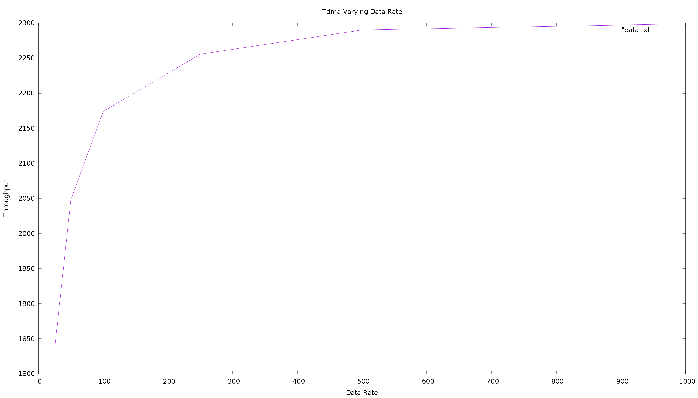

# ns3Project
Swathi and nathan's ns3 repo.

Data Rate is 100mbps forall graphs except the ones with varying data rate.

Throughput is in bytes/s.
=======
Throughput for these graphs is in bytes/s.
=======

This was generated with csmaTest.cc using multiple application containers and will probably be changed when we use another method for how many nodes are in the network.

This is the method we think is correct it uses a for loop to install nodes. 

This is a graph for tdma with 3 nodes and varying packet sizes.

Graph for tdma with varying nodes and a fixed packet size at 1024 bytes.

Graph for csma with varying nodes and a fixed packet size of 1024 bytes.

Graph for csma with varying data rates.

Graph for tdma with varying data rates.

