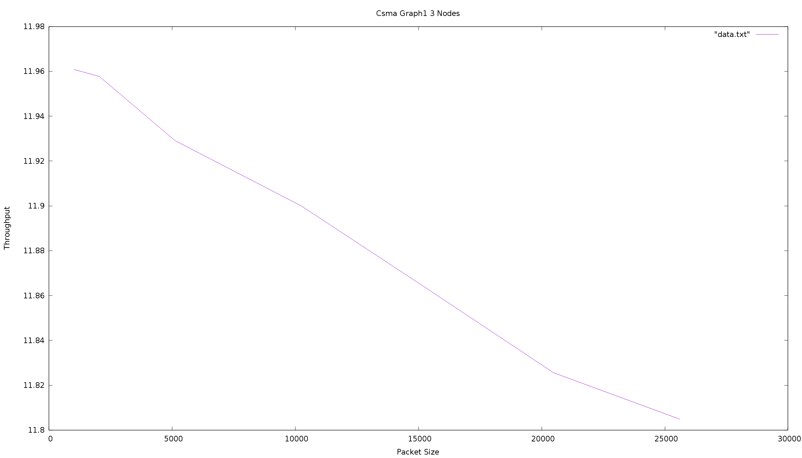
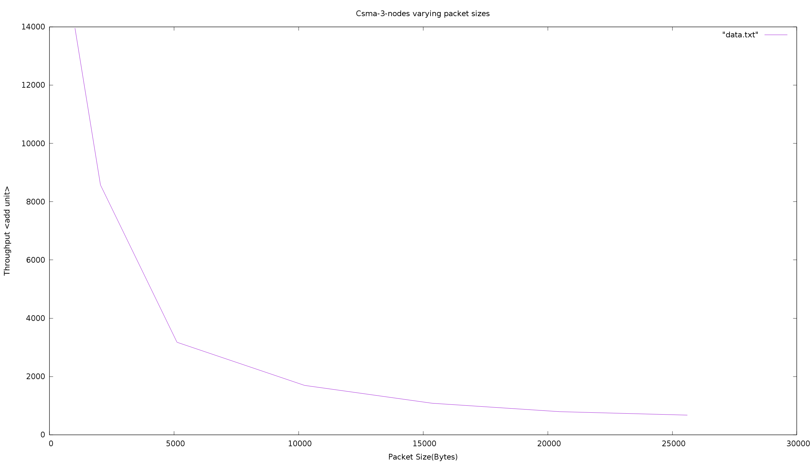
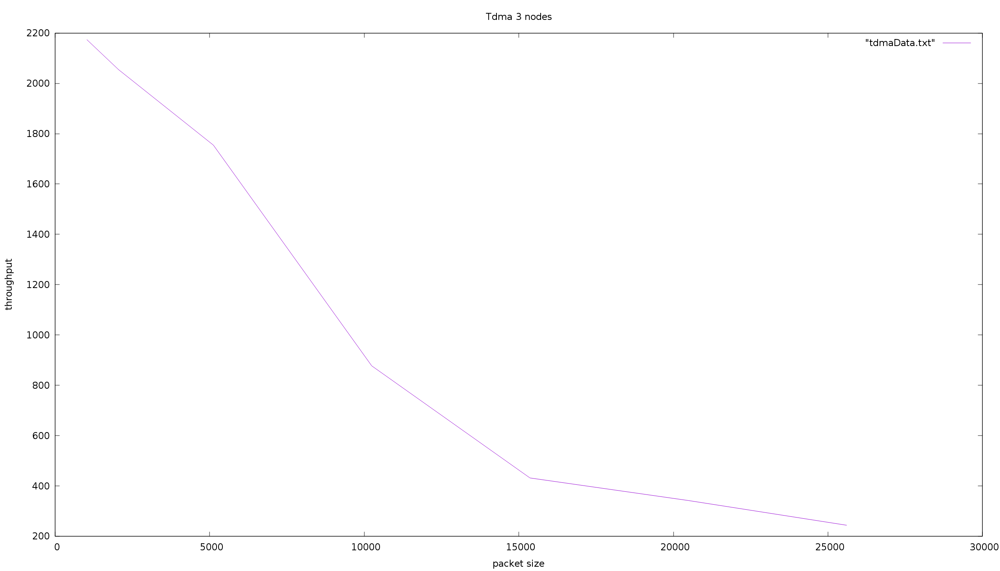
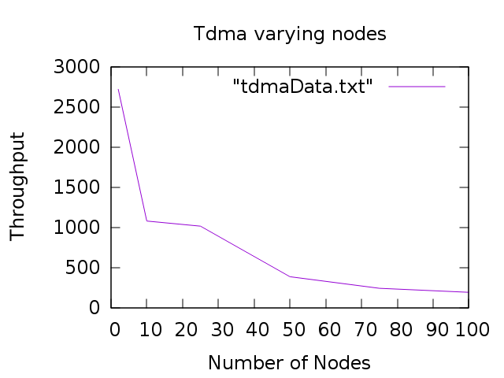
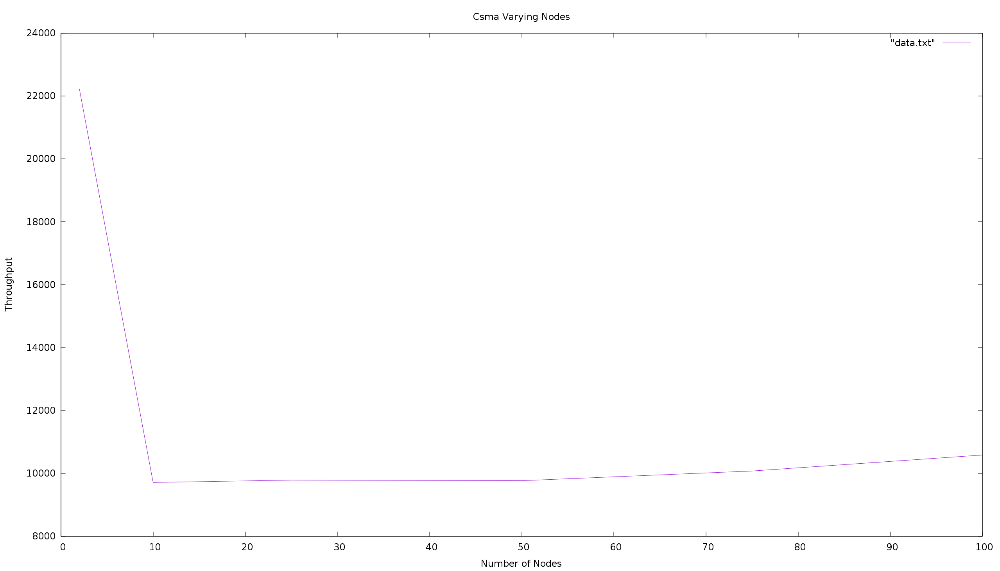
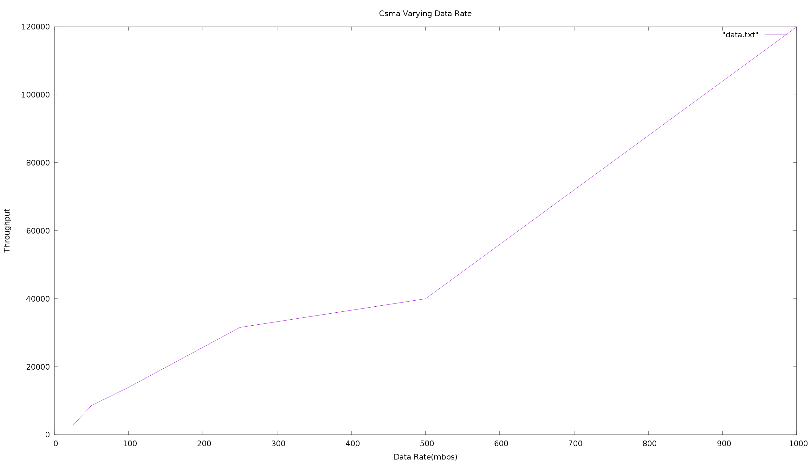

# ns3Project
Swathi and nathan's ns3 repo.

CSMA code is implemented in two ways , "for" loop or the application container. We are getting different outputs for the two methods.
What is the purpose of application container?. We are not able to figure out the difference between using multiple application containers and a for loop for installing nodes.

We think that using the method - for loop in csma.cc is the correct way to do it. This is because when increasing the number of nodes using two application containers the throughput went up.  With the for loop method in csma.cc throughput went down as expected.

<<<<<<< HEAD
Data Rate is 100mbps forall graphs except the ones with varying data rate.

Throughput is in bytes/s.
=======
Throughput for these graphs is in bytes/s.

>>>>>>> f5dbee0328f8be42c4e07eaab37768f2e07e1403

This was generated with csmaTest.cc using multiple application containers and will probably be changed when we use another method for how many nodes are in the network.

This is the method we think is correct it uses a for loop to install nodes. 

This is a graph for tdma with 3 nodes and varying packet sizes.

Graph for tdma with varying nodes and a fixed packet size at 1024 bytes.

Graph for csma with varying nodes and a fixed packet size of 1024 bytes.

Graph for csma with varying data rates.

